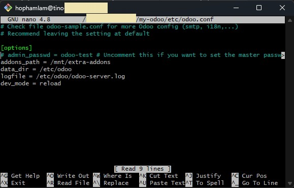
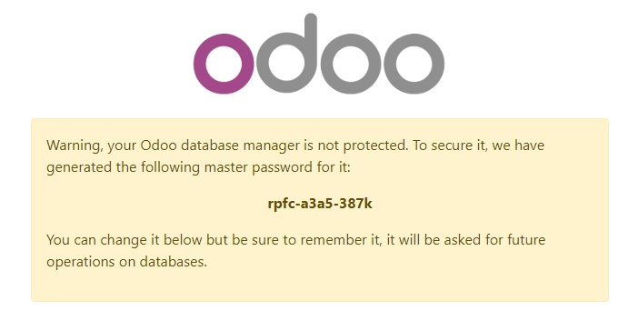

# hophamlam/my-odoo

test-run-6

This Odoo repo is built from [minhng92/odoo-13-docker-compose](https://github.com/minhng92/odoo-13-docker-compose) and include some of my features:

- Multi version
- `.env` with custom variables
- `CI/CD` using `Github Actions`
- `Production` ready (not too stressful 🤣🤣)

That's it, let's take a look!

# Prerequisites

- Recommended OS: Linux Ubuntu 20.04 LTS with at least 2GB RAM.
- Have basic understanding [Odoo](https://www.odoo.com/).
- [Docker](https://www.docker.com/) and [Docker-compose](https://docs.docker.com/compose/) installed (Check [my repo](https://github.com/hophamlam/initial-server) for initial server).

# First time setup

This will execute `sudo nano ~/my-odoo/.env` and bring you to `nano editor`, input yours or check my `.env`.

```bash
sudo git clone https://github.com/hophamlam/my-odoo.git &&
sudo nano ~/my-odoo/.env &&
sudo nano ~/my-odoo/etc/odoo.conf &&
sudo chmod -R 777 ~/my-odoo/addons &&
sudo chmod -R 777 ~/my-odoo/etc &&
sudo mkdir -p ~/my-odoo/postgresql &&
sudo chmod -R 777 ~/my-odoo/postgresql &&
sudo docker-compose -f ~/my-odoo/docker-compose.yml up -d
```

This is an example of my `.env`

```conf
ODOO_VERSION=16
PG_VERSION=15
APP_PORT=10016
DB_USER=test-odoo
DB_PASSWORD=test-odoo
```

This is an example of my `odoo.conf`

```conf
# Check file odoo-sample.conf for more Odoo config (smtp, i18n,...)
# Uncomment admin_passwd if you want to set the master password, a auto-generated password will provided at start-up if comment this line
# Recommend leaving the setting at default

[options]
; admin_passwd = odoo-test
addons_path = /mnt/extra-addons
data_dir = /etc/odoo
logfile = /etc/odoo/odoo-server.log
dev_mode = reload
```

It will ask for editing `odoo.conf`, leave it default if you're not experienced. You can set master password on your own or leave it commented (a auto-generated will be provided)






Check `localhost:10016` or the port you choose

Restart `Odoo containers stack`

```bash
sudo docker-compose -f ~/my-odoo/docker-compose.yml up --build --force-recreate -d
```

Edit `.env` variables

```bash
sudo nano ~/my-odoo/.env
```

Remove all `Odoo containers stack` and the whole directory `my-odoo`

```bash
sudo docker-compose -f ~/my-odoo/docker-compose.yml down &&
sudo rm -rf ~/my-odoo
```

Check log

```bash
cat ~/my-odoo/etc/odoo-server.log
```

Remove all the directories created by odoo-docker (in case you change to another odoo/postgres version):

```bash
sudo rm ~/my-odoo/etc/odoo-server.log
sudo rm -rf ~/my-odoo/etc/sessions
sudo rm -rf ~/my-odoo/etc/filestore
sudo rm -rf ~/my-odoo/postgresql/
```

# For production

Modify `Github Actions` workflows for your pipeline, mine is a very basic one.

This setup is tested with just few instances for less-than-10-user project (development, staging, production ci/cd with very low effort) and with not-so-busy activities. Should be carefully test if you use it as massive services (k8s, multi-workers, load balancing)

# Third-party apps I used

- [auto_database_backup_v16](https://apps.odoo.com/apps/modules/16.0/auto_database_backup/)
